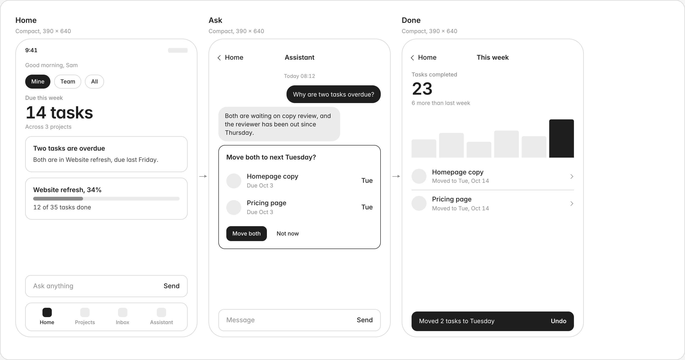

# Megamind Labs UI

A minimalistic wireframe kit for starting projects and getting them working before you design them.

Seven greys, one typeface, and grey squares where icons and photos will go. Feedback stays on flow and hierarchy instead of color and polish. One CSS file, no build step, no JavaScript required.

**[See every component and 26 starter screens](https://gitcamy.github.io/megamind-labs-ui/)**




## Why

High-fidelity mockups invite opinions about color. Napkin sketches can't show real density or real copy. Megamind Labs UI sits in between: real type, real spacing, real components, and nothing that looks decided before it is.

Made by [Megamind Labs](https://megamindlabs.ai), a design and product studio. We use it for early flows on client projects and wanted other designers to have it too.

## Quick start

Link the stylesheet, add `class="mm"` to a wrapper, and build with the classes.

```html
<link rel="stylesheet" href="https://cdn.jsdelivr.net/gh/gitcamy/megamind-labs-ui@main/megamind-labs-ui.css">

<body class="mm mm-canvas">
  <div class="mm-screen mm-screen--phone">
    <h1 class="mm-title">Welcome back</h1>
    <div class="mm-field">
      <label>Email</label>
      <input class="mm-input" placeholder="you@example.com">
    </div>
    <div class="mm-spacer"></div>
    <button class="mm-btn mm-btn--block">Continue</button>
  </div>
</body>
```

Or download `megamind-labs-ui.css` and link it locally. `screens/starter.html` is a blank flow you can duplicate.

## Presenting flows

Wrap screens in artboards and artboards in a flow. Arrows between screens are drawn for you.

```html
<section class="mm-flow-section">
  <h2>Flow 1: Sign up</h2>
  <p>Account, verify, invite.</p>
  <div class="mm-flow">
    <div class="mm-artboard">
      <div class="mm-artboard-name">1.1 Welcome</div>
      <div class="mm-artboard-meta">Phone, 390 x 844</div>
      <div class="mm-screen mm-screen--phone">...</div>
    </div>
    <div class="mm-artboard">...</div>
  </div>
</section>
```

Screen sizes: `--phone` (390 x 844, the default), `--compact` (390 x 640, a shorter frame for presenting flows), `--wide` (780 x 640, two panes), `--tablet` (820 x 1180), `--desktop` (1280 x 800), `--fluid`. For anything else, set `--mm-w` and `--mm-h`.

Pin numbered notes on a mockup with `.mm-note` and explain them beside it with `.mm-notes`.

## Components

| Group | Classes |
| --- | --- |
| Layout | `mm-stack` `mm-row` `mm-grid-2` `mm-spacer` `mm-gap-1..6` `mm-between` `mm-screen-body` `mm-split` `mm-pane` |
| Type | `mm-display` `mm-hero` `mm-title` `mm-heading` `mm-body` `mm-small` `mm-label` `mm-caption` `mm-strong` `mm-muted` |
| Navigation | `mm-statusbar` `mm-navbar` `mm-back` `mm-tabbar` `mm-tab` `mm-sidenav` `mm-steps` `mm-dots` |
| Actions | `mm-btn` (`--secondary` `--ghost` `--danger` `--sm` `--icon` `--block`) `mm-link` `mm-fab` |
| Inputs | `mm-field` `mm-input` `mm-select` `mm-textarea` `mm-inputbar` `mm-search` `mm-otp` `mm-keypad` `mm-slider` |
| Selection | `mm-chip` `mm-segmented` `mm-toggle` `mm-check` `mm-radio` `mm-choice` |
| Content | `mm-card` (`--filled` `--ink`) `mm-list` `mm-list-row` `mm-section-head` `mm-kv` `mm-accordion` `mm-table` `mm-divider` |
| Data | `mm-stat` `mm-delta` `mm-progress` `mm-ring` `mm-bars` `mm-timeline` `mm-week` |
| Media | `mm-ph` (`--x` `--square` `--wide` `--portrait` `--round`) `mm-icon` `mm-avatar` `mm-avatars` `mm-badge` `mm-dot` |
| Conversation | `mm-thread` `mm-bubble` (`--me`) `mm-typing` `mm-proposal` `mm-suggestions` `mm-wave` |
| Feedback | `mm-banner` `mm-toast` `mm-notification` `mm-live` `mm-empty` `mm-skeleton` `mm-spinner` |
| Overlays | `mm-scrim` `mm-sheet` `mm-dialog` `mm-menu` `mm-tooltip` (overlays take `--static` for docs) |
| Presentation | `mm-canvas` `mm-flow-section` `mm-flow` `mm-artboard` `mm-screen` `mm-note` `mm-notes` |

States use real attributes where they exist: `aria-pressed="true"` for chips and segments, `aria-current="page"` for tabs and nav, `:checked` for toggles, `disabled` for buttons. Use `.is-active` or `.is-done` where there is no native attribute.

Values that vary per instance are CSS variables set inline: `style="--mm-value: 34%"` on progress, bars and waves, `--mm-value: 68` on rings, `--mm-size: 32px` on icons, avatars and rings.

## React

`react/MegamindLabsUI.jsx` wraps every component. Copy it into your project and import the stylesheet once.

```jsx
import "./megamind-labs-ui.css";
import { Canvas, FlowSection, Artboard, NavBar, Stat, Card, Progress, Spacer, Button } from "./MegamindLabsUI";

export default function Mockup() {
  return (
    <Canvas>
      <FlowSection title="Flow 2: Projects" description="Check progress on a project.">
        <Artboard name="2.1 Project" device="compact">
          <NavBar back="Projects" title="Website refresh" />
          <Stat label="Tasks done" value="12" meta="of 35" />
          <Card title="On track"><Progress value={34} /></Card>
          <Spacer />
          <Button block>Add a task</Button>
        </Artboard>
      </FlowSection>
    </Canvas>
  );
}
```

## Theming

Everything is a variable on `:root`. Override them after the stylesheet.

```css
:root {
  --mm-ink: #111827;
  --mm-font: "IBM Plex Sans", sans-serif;
  --mm-r-md: 8px;
}
```

Add `data-theme="dark"` to any element (a single screen or the whole page) for the inverted palette.

## Using it with AI tools

Paste the contents of [`PROMPT.md`](PROMPT.md) into Claude, v0, Lovable, Cursor or similar, then describe the screens you want. The prompt teaches the tool the class names and the rules of the system, so the output stays on-kit.

## Principles

1. **Grey means undecided.** Fills stand in for anything not designed yet.
2. **Ink means it matters.** Near-black only for the primary action, the active state, and the key number.
3. **One line weight.** Every border is 1px in the same grey.
4. **No color, even for errors.** Danger is a dashed outline, errors are a bold message with a mark.
5. **Real words.** Write the actual copy. Lorem ipsum hides the hardest design problems.

## Contributing

Issues and pull requests are welcome. Keep additions greyscale, built from existing tokens, and usable without JavaScript. Add a specimen to `index.html` for anything new.

## License

MIT. Use it for anything, including client work.
